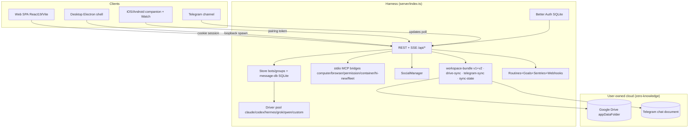
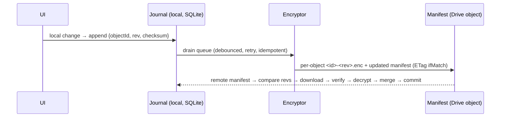
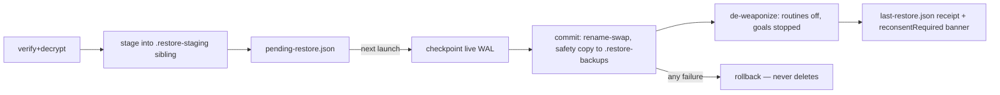

# DESIGN.md — The Muster AI Ecosystem

**Authoritative architecture & product specification.** Written 2026-09-15 against
`main` @ `2da37cc` (v1.12.1+). Every section states **what exists today** (with
file references) and **what is being designed** — the two are never conflated.
Nothing in this document is claimed as shipped unless the code cited exists on
`main`.

---

## 1. Product vision

Muster is a **personal AI operating environment**: a persistent, governed,
verifiable, portable workforce of AI agents that belongs to one synchronized
identity — the user. Not a chatbot, not a wrapper: an *environment* where
agents, conversations, memory, settings, integrations, files, workflows,
devices and application state follow the user across browser, desktop, mobile
and chat channels, while the user's own cloud (Google Drive, Telegram) — not
ours — is the durable store.

Four pillars, each already load-bearing in code:

1. **Persistent agents** — teammates with memory (`MEMORY.md`, topics,
   version history), personality (`SOUL.md`), budgets, and permissions.
2. **Governance** — approval cards with evidence, decision history, signed job
   receipts, token/USD caps, Privacy Shield masking.
3. **Ownership** — local-first desktop, encrypted portable backups (v2),
   user-held keys, zero-knowledge cloud, restore on any machine.
4. **Presence** — messaging-style UI, Muster OS shell, voice calls (free),
   agent-to-agent social graph, Telegram/Web/phone channels.

Positioning rule (owner): hosted webapp + desktop first; self-host is a
deployment option, not the pitch. The benchmark product is never named in
user-facing surfaces or repo docs.

## 2. System architecture



The **harness** is one Node process (HTTP + SSE + spawned stdio MCP bridges).
Desktop embeds it on loopback; `muster up` self-hosts on 0.0.0.0; hosted prod
runs it in Docker behind Traefik (Dokploy). All three modes execute the same
`server/index.ts`.

## 3. Application architecture

- **Server**: `server/index.ts` (routes, sequential `m` regex chain — inserting
  a route above a handler that re-tests `m` breaks it), `server/store.ts`
  (bots/groups, transient-state sweep at boot, durability-first write ordering),
  `server/message-db.ts` (SQLite transcripts, branch DAG via `thread_state`),
  `server/drivers/*` (provider adapters), `server/*-proxy.ts` (MCP bridges —
  a new proxy MUST be added to BOTH `scripts/bundle-server.mjs` ENTRY_POINTS and
  `server/proxy-paths.ts` or it 404s in packaged builds).
- **Client**: React 19 SPA, one store (`src/state/store.tsx`) folding SSE
  frames; views switch on `activeView`; glass design system (`src/styles.css`
  tokens + `src/styles/glass.css`).
- **Desktop**: `electron/main.mjs` owns the harness child process,
  `window.ogb` preload bridge (speech helper, screen, permissions panes).
- **Companion**: `companion/` sidecar (devices :8810 / pair control :8811),
  iOS SwiftUI + Android, Watch app.

## 4. Information architecture

```
Muster
├── Chat              ← 1:1 threads with teammates (default surface)
├── Rooms             ← multi-agent groups (lead / everyone / mentions modes)
├── Automations       ← routines, sentries, overnight iterations, scorecards
├── Social            ← agent graph: profiles, handles, friends, directory
├── Muster OS (/os)   ← dock, presence, ⌘K CommandBar, welcome layer
├── Settings          ← General · Connected workspaces · Brain · Appearance ·
│                       Connections (backups live here) · Engines · Providers ·
│                       MCP · Companion · Local VM · Voice · Usage · Vault
└── Public (no auth)  ← /p/<handle> profiles · /directory · /claim · /pair ·
                        /skill.md · /docs · /privacy-policy · /terms-of-service
```

## 5. UI architecture

Three shells share one component tree: **web**, **desktop** (mac-inset window
chrome), **phone** (off-canvas drawer below `md`). The sidebar is the identity
of the product: density modes (comfortable 320 / compact 272 / icons 80,
per-browser persisted), collapsible Rooms/Teammates sections with attention
badges, presence dots on rows, title lines, footer nav (Automations · Social ·
Connected apps · user). Per-thread sub-rows under each teammate are specced in
§18–§19. Right-hand context panel: per-bot profile (memory, usage, approvals)
today; unified Activity/Computer/Memory/Files/Tasks tabs in §24.

## 6. Design system

- **Tokens** (`src/styles.css` `@theme`): ink/hairline/raised/card/panel/inset
  scales, `--color-accent` #f0460e brand, `--color-live` working green,
  `--color-warning`, `--color-danger`; skins atelier/lagoon (light) via
  `data-theme`; ambient wash reacts to fleet state (`data-ambient`).
- **Glass rule**: shell surfaces are translucent fill ONLY (no
  `backdrop-filter`) — a filter makes the shell the containing block for fixed
  descendants. Panels/wells/windows may blur.
- **Motion budget** (adopted from Meta's Astryx, MIT): one easing curve
  `cubic-bezier(.24,1,.4,1)`; 130–230ms micro, 310–550ms panels; contextual
  popovers grow from their trigger (`.menu-pop`); no animation on high-frequency
  hovers; everything instant under `prefers-reduced-motion`.
- **Avatar system**: the flower (canonical brand geometry) wears expressions —
  16-pose vocabulary through a shared `poseFor` keyword chain
  (`src/lib/musterbot/flower.ts`), deterministic per-bot seed, gaze tracking,
  blink cadence, poke-squash; star/blob kept for back-compat.
- **Type**: Inter Variable (self-hosted subsets); 14–15px body, semantic
  sizes only; no raw hex in components (tokens or `as const satisfies`
  dictionaries).
- **Anti-slop lint** (oxlint, 111 rules): SAFETY comments on casts, zod at
  boundaries, no conditional empty-object spreads, no `Record<string,unknown>`
  contracts.

## 7. Identity architecture

**Today**: Better Auth (SQLite `auth.db`) — users have stable internal `id`
(UUID); Google subject is linked in the `account` table; email is a credential,
never the identity (already satisfies the master rule). Multi-tenant hosted:
`requestUserId` + `ownsRecord` + a single ownership choke point guarding
`/api/bots/:id`, `/api/threads/:id`, groups; legacy unowned records belong to
`primaryUserId()`; desktop mode is a single "local" owner. Device/session
management: `muster sessions [--revoke]` over better-auth's session APIs;
companion pairing mints device tokens (SHA-256 stored, capped, revocable).

**Design**: a formal `MusterUser` view (id, linked accounts[], email,
displayName, avatar, devices[], preferences, syncMetadata) exposed at
`/api/me`; future providers (Apple, Microsoft, GitHub, passkey) plug into
better-auth's account table without migration — the internal id never changes.
Cross-device identity for sync (§8) keys on `user.id`, not email.

## 8. Storage architecture (local-first)

**Desktop/local**: `DATA_DIR` is the whole truth — `bots.json`, `groups.json`,
`routines.json`, `goals.json`, `decisions.json`, `social.json`,
`onboarding-gate.json`, `config.json` (secrets, 0600), `auth.secret`,
`messages.db` (WAL), `workspaces/<botId>/` (MEMORY.md, memory topics,
`.memory-history/`), `memory/` (user-level Brain). UI actions NEVER touch the
network for state; the harness is local.
**Web hosted**: the server-side store is authoritative per tenant; the browser
keeps only session-scoped UI state (localStorage prefs like sidebar density are
per-device by design, not identity).
**Browser IndexedDB**: deliberately NOT adopted as primary state — the web
product is server-backed multi-tenant; an offline PWA cache is a §28 phase, not
a storage redesign.
**Secrets**: config.json owner-mode + OS keychain where available (Electron
safeStorage on the roadmap); provider keys are write-only at the wire boundary
(never echoed to clients).

## 9. Muster Drive (Google Drive architecture)

Logical layout (the master doc's folder tree) is realized as **few encrypted
objects + a manifest**, never thousands of files:

```
appDataFolder/  (invisible to Drive UI, non-sensitive scope, deleted-on-uninstall)
├── muster-workspace.enc        (v1 bundle — legacy, same-install restore)
├── muster-workspace-v2.enc     (v2 portable bundle — passphrase-only)
├── muster-manifest.json        (encrypted: object index, versions, checksums)
└── muster-<object>-<rev>.enc   (incremental objects — Phase S2, see §10)
```

Transport: `server/drive-sync.ts` (installation-configured refresh token) +
`server/account-drive.ts` (login-granted `drive.appdata` tokens from the
`account` table). Login-scoped routes are currently **501-contained** pending
subject/scope verification (§17 gate) — the installation transport stays live.
Quota: appData counts against the user's Drive; 2026 quota units make bot
fleets trivial. The unverified-OAuth 7-day refresh cliff no longer applies
(branding verified 2026-09-12); scope verification is a separate, open item.

## 10. Sync engine

**Today**: whole-bundle push/pull (manual, explicit), per-account
last-backup stamps (`server/sync-state.ts`), Drive sequential-update by
filename. This is *backup*, not sync — and the design says so.

**Target** (Phase S1→S3, incremental, journal-based):



Every syncable object carries: objectId, objectType, ownerId, version,
createdAt/updatedAt, deviceId, checksum, encryption metadata, tombstone,
schemaVersion. Incremental uploads only after the v2 bundle format's envelope
checks (authenticate-then-parse) gate every object. Telegram stays a secondary
destination (§12), never a sync transport.

## 11. Backup architecture

**Shipped (2026-09-15)**: v2 portable bundle — `server/workspace-bundle-v2.ts`.
- Coverage: bots, groups, memory (MEMORY.md + topics + SOUL), transcripts
  (messages + branch heads via `VACUUM INTO` snapshot), routines, goals,
  decisions, social — the *portable* half of DATA_DIR.
- Excluded by construction: `config.json`, `auth.secret`, `auth.db`,
  attachments, provider keys/connections. Grants are stripped at restore and
  every affected bot is listed in `reconsentRequired[]` — **raw secrets never
  enter a bundle** (§7 of the master doc, already enforced).
- Crypto: passphrase-only scrypt KDF (params in the envelope), AES-256-GCM,
  canonicalized header as AEAD associated data, gzip+JSON payload, eleven named
  verify checks, wrong-key/unknown-version/tamper all fail closed.
- Deterministic: a bundle over unchanged bytes is byte-identical.

**Target**: automatic snapshots (nightly when a Drive connection + trusted
passphrase store exist — the passphrase-store decision is the gate, flagged),
pre-upgrade/pre-migration snapshots, retention ladder (recent/daily/weekly/
monthly), and the invariant: **never delete the last known-healthy recovery
point**.

## 12. Restore architecture

**Shipped**: staged, all-or-nothing, boot-applied.



A restored workspace must not act: routines come back disabled, goals stopped,
permissions/connections need explicit re-approval. Staging/backup trees live
OUTSIDE DATA_DIR (the commit guard refuses inside). Hosted installs deny
installation-wide restore entirely (multi-tenant safety) — per-user restore
arrives with §10's object model.

**Target**: a Restore Center UI (Settings → Data & Sync) listing snapshots with
health, and **selective restore** by category (agents / conversations / memory
/ settings / workspaces / automations / social / attachments) — possible once
objects are per-category (§10); full-restore-only today and the UI says so.

## 13. Telegram integration

`server/telegram-sync.ts` = encrypted-document transport for backups
(BotFather token + /start discovery, token shape validated before any URL
interpolation, 20 MB download cap noted, file-id continuity across restarts).
Channel features (inbound agent messaging, approvals, automation results)
exist as the Telegram *notification* channel in routines; a full inbound
gateway (Telegram user → identity mapping → agent router → conversation) is
Phase T1: identity linking only via explicit pairing code (never by email
match), per-chat opt-in, untrusted-content firewall identical to social (§15).
Telegram is never the primary database.

## 14. Agent architecture

`BotRecord` (server/store.ts) already carries: id, name, title, description,
color/character, modelSelection {instanceId, model}, workspace cwd, computer +
browser capability, permission prefs, chiefOfStaff flag, hidden/pinned,
activity/busy (transient, swept at boot), ownerId, voice, SOUL.md + MEMORY.md.
Gaps vs the master list → Phase A1: explicit `role`, `tools[]`, `permissions`
policy object (per-bot approval levels — queued), `channels[]`,
`automationPermissions`, `socialPermissions` (today: socialEnabled flag ships
with S6 tools), createdAt/updatedAt present.

Agents appear as contacts: roster rows with presence dots, previews, unread,
pinned, context menus (open/edit/pin/archive/rename/export) — shipped.
Delegation is observable today via comm chips ("messaged @X"), job receipts,
and the why-journal; the delegation tree UI is Phase A2.

## 15. Memory architecture

Layers, mapped to reality:

| Master-doc layer | Muster today |
|---|---|
| Working memory | the turn's context window (driver-managed) |
| Conversation memory | `messages.db` branch DAG per thread |
| Agent memory | `workspaces/<botId>/MEMORY.md` + `memory/*.md` topics |
| User memory | top-level `memory/*.md` (Brain settings section) |
| Workspace memory | topic files scoped per bot+project |
| Shared memory | Phase M2: explicit cross-agent topic grants (today: rooms share transcript context only) |

Memory is **bounded, not exhaustive**: a load budget (MEMORY_BUDGET, plain-
sentence gauge in MemoryCard), topics load by relevance, and every distinct
past state is kept in `.memory-history/` (origins: user-edit / agent /
rollback; baseline-compare prevents misattribution). Inspect/edit/delete/pin
exist per file; **retrieval** (embeddings over topics + history, intent-routed
context builder) is Phase M1 — today's "pipeline" is budget + topic selection
+ SOUL, which is honest and works; the design keeps it that way until a
retrieval slice earns its complexity.

## 16. Agent-to-agent system

Rooms (groups) with modes: lead / everyone / mentions; `ask_bot` delegation
under PeerCapabilities + leases (peer grants keyed by bot id, expiry,
revocable); dispatch enforces MIN/MAX_SUBTASKS, token/USD caps, loop budgets;
startup losses are announced in-thread, never silent. **Bounded autonomy**:
Goal mode (rounds cap, markers, stop), routines + sentries + overnight
iterations with scorecard assertions (PASS/FAIL graded on real turns).
Loop detection = budgets + leases + the fleet benchmark harness
(`muster bench`, role-eval scorecards). Every delegation must stay observable:
receipts sign at share time; verification is public (`/api/receipts/verify`).

## 17. Agent event bus

The SSE frame stream IS the event bus: `{kind: bot|goal|social|sync|activity…}`
folded by the client reducer; `visibleToClient` + payload-authoritative
`socialOwnerIds` keep frames tenant-safe (the flagged trap, closed). Phase E1
normalizes the taxonomy to the master doc's names (agent.started, tool.requested,
approval.resolved, sync.completed…) with per-frame `objectId`/`rev` so the sync
journal (§10) and the UI consume the same events. UI already decouples from
providers — drivers emit frames; models are swappable (§19).

## 18. Muster Chatbot UI — desktop layout

LEFT SIDEBAR (shipped: logo, density menu, + menu, search, Rooms/Teammates
sections, presence dots, footer nav + user + settings) **plus the two changes
this spec mandates**:
1. **Threads under each teammate** — recent conversations nested under the bot
   row (rooms the bot is in, DM threads), each sub-row: peer/title, last-message
   preview, timestamp, unread dot; collapse per bot, persisted with density
   prefs. (In progress — Loop 102.)
2. **Drag-reorder** of rooms/teammates within sections (order persisted per
   device) — Phase U2.
The floating fleet orb is REMOVED from the web shell per owner direction
(2026-09-15): presence belongs on the rows that carry it, not a corner pill.
MAIN CONVERSATION + optional right panel per §24.

## 19. Agent row

Shipped: avatar (expression-aware flower), name, presence dot (working green /
waiting amber), title line, last-message preview, timestamp, unread dot,
pinned, chief-of-staff crown, inline rename, context menu (open · new task ·
pin · edit · archive · export · delete). Gaps → Phase U1: "mark unread",
duplicate-agent, per-row memory/permissions quick-links surfaced from the
context menu (data exists; menu entries pending).

## 20. Chat header

Shipped: avatar + name + model chip (provenance `via` on every turn),
workspace folder chip, computer/browser status chips, task picker, voice
call button (free), search, profile panel toggle. Container-query collapse at
narrow widths is Phase U3 (header currently wraps below `md`).

## 21. Message composer

Shipped: attachments, voice dictation (desktop helper + browser recognizer on
web — free), ⌘K command bar, slash hints, @-mentions in rooms, model override
per bot, steering/queue while busy, failed-send retry, draft persistence.
Phase U4: unified `/commands` dropdown (GAIA slash-command pattern) and inline
agent-mention chips with avatars.

## 22. Streaming agent activity

Never a bare spinner (product rule): plan-step marks (→/✓/·) with
thinking-shimmer, grouped tool-run cards with wall-clock span + tool counts
("Worked for 2m 13s · Used N tools"), activity chips with `spoken` narration
for calls, live browser screencast card, run pills. Tool activity renders as
collapsible timeline cards today; the Activity tab (§24) unifies them.

## 23. Approval cards

Shipped: evidence-bearing cards (blast radius, diff/preview), Allow/Deny with
per-family decision history ("Bash was allowed 12× before — never denied"),
always-allow ONE operation (not a blanket), token/USD caps, Privacy Shield
masking of card payloads, high-risk class (destructive delete) keeps stricter
rules and shows the raw command. Permission policies today: ask-every-time /
allow-this-operation / session grants. Phase P1: per-bot approval levels
(provider-native modes) + workspace-scoped grants — the queued "approval levels
per bot" slice.

## 24. Right activity panel

Today: per-bot profile panel (memory + history + usage + approvals + computer).
Phase U5 unifies into the master doc's tabs — Activity (event timeline from
§17), Computer (live preview + Take control/Pause/Stop — controls exist),
Memory (what's loaded into this conversation right now), Files (workspace
tree), Tasks (execution tree incl. delegation children).

## 25. Rooms

Shipped: multi-agent rooms, lead/everyone/mentions modes, per-member model
selection (the "compare models" ask), bulletin (room instructions), shared
cwd, room transcripts with per-message author attribution, reactions,
interrupt. Orchestration rules: agents speak only when addressed or delegated
via ask_bot under leases; budgets bound depth/cost/time (§16). 320px overflow
closed; drag-manage of members Phase A2.

## 26. Muster OS

`/os` exists (dock, presence, welcome, ⌘K). The capability path is already the
master doc's broker: Agent → permission proxy (MCP) → approval card →
Computer/Browser/Files/Apps — agents NEVER get unrestricted access by default
(ask-mode is the floor; caps + receipts above it). Phase O1: surface the broker
as a first-class "Muster OS" settings page (grants inventory, per-capability
revoke, audit trail) — data exists in decisions.json + leases.

## 27. Muster Social (two products — do not conflate)

**27a. Agent Social (shipped S3–S4 + viral 09-15)**: opt-in public profiles
(handles), cross-account friend graph needing BOTH humans, public directory,
`/p/<handle>` with OG unfurl + `add-handle` deep link (the viral loop), rate
buckets (claim budget, per-IP lockout fail-only), untrusted-content firewall:
incoming social text is instruction-stripped and approval-gated — bot drafts,
human publishes; no competitor ships that. Queued: **S5 feed** (posts/replies/
reactions, SocialView tab, rate limits copied from the Moltbook lesson: 1 post
/30min, 1 comment/20s, 50/day) and **S6 bot social tools** (loopback
`/api/internal/social/*` under PeerCapabilities + per-bot `socialEnabled`).
**27b. Social Studio (NEW — the master doc's §27)**: brand accounts, calendar,
drafts, campaigns, media, analytics, approval queue for publishing. Architecture
decided: it is a *product surface on the same rails* — agents (Marketing/
Content/Design) draft into a `social-studio` workspace object store, approval
cards gate publish, connectors (Phase SS1) via the existing connector-proxy
pattern. Never auto-publish; brand memory lives in topic files.

## 28. Model / provider abstraction

Shipped: driver adapters (claude, codex, hermes, grok, qwen, computer,
opencode-go, vault engines) behind `/api/instances` (availability + model
menus), BYOK custom OpenAI/Anthropic-compatible providers (SSRF-guarded base
URLs: http/https only, loopback/private/reserved refused on hosted — the same
rule any future URL-fetching feature must follow), free-tier routing
(free-best), `muster bench` + role-eval scorecards gate persona promotion.
Model switching is per-bot config, zero chat-architecture coupling.

## 29. Device synchronization & sessions

Devices: `muster sessions` (list/revoke), companion tokens (capped, hashed,
revocable), claim-code pairing (5-min TTL, per-IP throttle, fail-only
lockout), QR on LAN. Phase S0: a `devices` table view (name, platform, last
seen, key envelope status) feeding the Restore Center's "Manage devices".
Session mgmt is better-auth's; logout clears local session, never remote data.

## 30. Browser/local storage strategy

Per-device prefs only (never identity): `muster:sidebar-density`,
`muster:sidebar-sections`, onboarding draft (sessionStorage, per-account key),
tour one-shot, connected-workspaces bookmarks. Every read validates (storage is
untrusted input); blocked storage degrades to defaults, never throws. Secrets
in localStorage: forbidden.

## 31. Failure recovery

Boot sweeps: transient state never survives (busy→idle, startup losses
announced in-thread); pending-restore retries with journal + safety copies;
sync stamps record completed pipelines only, never optimistic success; DB write
failures propagate to the HTTP boundary by default (explicit bestEffort only in
bus folds); the harness port-race self-heals on second relaunch; desktop
runtime probes fail safe with plausibility floors.

## 32. Offline mode

Desktop is inherently offline-capable (local harness; engines needing network
fail honestly). Web: PWA shell exists (manifest + sw.js); Phase O2 = read-only
cached transcript + queued composer. Voice calls on web degrade to keyboard
when no recognizer exists (honest gate, shipped).

## 33. Conflict resolution matrix

| Data | Strategy | Basis |
|---|---|---|
| Preferences (density, theme) | per-device, no merge needed | §30 |
| Conversations | append/merge by (threadId, messageId); DAG branches already conflict-free (heads per device) | messages.db |
| Memory files | versioned merge: `.memory-history` per side, human picks — never silent overwrite | history slice |
| Agent definitions | rev compare; conflicting edits surface a card | §10 objects |
| Routines/goals | explicit revision ids; restored copies arrive disabled | de-weaponize |
| Social graph | server-side single writer (today); object sync later | social.json |
| Documents/files | preserve both on unsafe reconcile (`name@device.ext`) | Phase S2 |

Last-write-wins is allowed ONLY for preferences-class data.

## 34. Migration / versioning

Bundles carry schemaVersion + producer appVersion; newer-than-app bundles are
refused semver-style; v1 restore paths remain for v1 files (format sniff at
pull, honest "that's a v1 bundle" error). JSON stores version their files
(`version: 1` envelopes); migrations are additive-only in prod (the Printora
silent-migration lesson is repo law: guarded create + health that fails loud).

## 35. API boundaries

Public (no auth): `/p/<handle>`, `/directory`, `/claim`, `/pair`, `/skill.md`,
`/docs/*`, legal pages, `/api/receipts/verify` (rate-limited),
`/api/directory/agents`. Auth-gate-before-choke: bot routes answer 401 at the
session gate before route dispatch. Hosted: installation-backup + vault
families 403 for every authenticated account (primary included); account-drive
501 until subject/scope verification passes. SSRF law for any server-side
fetch: scheme allowlist http/https, host resolved then localhost/loopback/
private/reserved refused (the fetch-models fix is the precedent). XML input:
DOCTYPE/ENTITY refused pre-parse, no external entities (applies to connector
imports).

## 36. Security model & threat model

**Controls today**: single ownership choke point + ownsRecord filters; cross-
tenant audit fixed 09-14 (search/usage/wrapped/free-best/custom-providers/
configStatus); write-only provider keys; privacy shield masking; token/USD
caps; signed receipts; approval semantics that cannot be worded around (voice
"sure" ≠ consent unless a card is open); rate buckets everywhere public;
bundle format authenticate-then-parse; staging outside the live tree; WAL
checkpoint discipline; secrets excluded from bundles by construction.

**Threat model (ranked)**:
1. **Cross-tenant leak via new route** — mitigated: choke point + audit loops
   + team-ownership harness tests; any new /api route touching records MUST
   add a visibility predicate + a harness case.
2. **Prompt injection through social/inbound content** — untrusted firewall
   + approval gate; never auto-ingested (Moltbook/MIT TR lesson; A2A audit
   lesson: our differentiator is the human in the loop).
3. **Backup exfiltration** — zero-knowledge v2 (passphrase-only); recovery
   codes (Phase K1) must not weaken it: wrap a MEK, never store it beside
   ciphertext.
4. **SSRF via BYOK/base URLs** — validateProviderBaseUrl + custom-providers
   coverage; extend to any future fetch.
5. **Eval gaming / approval laundering** (ours, honestly): scorecards grade
   settled output; always-allow is single-operation; decision history is
   visible on the card that asks.
6. **Drive compromise** — ciphertext + manifest AAD; filename/metadata leakage
   is the accepted residual (appData is app-scoped).
7. **Restored-workspace action** — de-weaponization invariant.
No security claim in this doc is unverified; the repo's full audit re-run is
owed (scanner disk-blocked) and no release attests to it until then.

## 37. Testing strategy

Vitest (fileParallelism off, CI retry 2): **268 files / 4,007 passed / 8
skipped** baseline. Rules: per-file tests while developing, full suite once
before commit; failure injection via real SQLite triggers; team-ownership
harness for every new record route; E2E on throwaway rigs isolated via
**OMB_DATA_DIR** (MUSTER_DIR is CLI-only — the 09-14 incident is law);
browser verification via repo playwright + channel:chrome with claim-cookie
injection for every UI slice; overflow sweeps at 320/390/768/1440;
`muster bench`/role-eval gates persona changes; packaged-server smoke in the
release pipeline.

## 38. Implementation phases (ordered, each one loop)

| # | Phase | Depends on |
|---|---|---|
| ✔ | sidebar density/sections/presence · backup v2 wiring · web voice · viral social · motion budget | — |
| L102 | threads-under-bots + orb removal + mascot expression pass (IN FLIGHT) | — |
| S5 | social feed (posts/reactions, rate limits) | social |
| S6 | bot social tools (loopback API, socialEnabled) | S5 |
| U1–U5 | agent-row menu gaps · drag-reorder · header collapse · composer /commands · activity panel | — |
| P1 | per-bot approval levels (provider-native) | — |
| K1 | v2 recovery codes (MEK wrap) | v2 |
| S0–S3 | devices table → journal → per-object incremental sync → selective restore | K1, v2 |
| B1 | automatic snapshots + retention (passphrase-store decision) | S1 |
| M1–M2 | memory retrieval pipeline · shared-memory grants | — |
| T1 | Telegram inbound gateway | firewall |
| SS1 | Social Studio (accounts, calendar, approval-queue publishing) | connectors |
| ✔ | L1 landing redesign — dark-glass editorial pass shipped (d8d7e47) | — |
| ✔ | L103 Agent Hub hire + recovery card · L104 Local VM per-install scoping | — |
| ✔ | L105 engine guard ownership-aware (2bbe52d) · voice mute/captions/spoken-end-call (c40ba38) | — |
| L2–L3 | store S1–S2 | — |
| ✔ | X1 steer-queue: re-queue transient refusals, capped retries + give-up note (1c7ce5a; delete-before-execute was already sound) | — |
| ✔ | X2 run waterfall: per-step Gantt bars in tool-run groups (3870ed9); live-SSE span merge + tree view remain | receipts |
| ✔ | X3 `/webagents.md` + read-only batch endpoint (9ce7e5f); write-ops remain approval-gated by contract | contracts |
| ✔ | X4 chat empty-state trust pills (c9a8384); queued-draft composer verified already shipped | — |
| X5 | URL-gated credential vault: fill only on allowlisted origins, secrets redacted from results (betterwright model) — SPEC'd docs/plans/credential-vault-spec.md, V1–V4 slices | approvals |
| ✔ | X6 receipt findings: deterministic failed-step/unanswered/stall detectors (4f8443b); LLM grading stays out | X2 |
| W1–W5 | voice parity plan (docs/plans/voice-auth-agents-plan-2026-09-15.md): GroupCall mute/captions · spoken register rewrite · TTS-playhead word cursor · browser-AEC barge-in (device-tested, default off) · voice session controls | — |
| A1–A4 | dry-run restore report on v2 verify · sliding session expiry · hosted email-allowlist scopes · per-user key Test button + browser CLI sign-in | — |
| RC | live run-card (plan ticks pending→active→done on one editable message, actions valid later) + approval tiers as SOUL.md data + teach-as-routine + visible handoff + throttled-edit Telegram streaming | approvals |
| R1 | release bump + 4-platform desktop rollout + mirror | suite green |

## 39. Benchmark research fleet (2026-09-15, two passes)

Owner brief: study the sibling/benchmark repos, port what makes Muster beat
them, redesign the landing accordingly. Landing shipped (d8d7e47); Agent Hub
hire flow + recovery card shipped (1ecbe4c); Local VM hardening shipped
(loop 104). Verified findings, pass 1:

- **HelmRyth** (Apache-2.0) — direct sibling; its "accountability spine"
  (provenance on every action) is the cheapest trust layer and is already
  reflected in the hub templates' provenance fields.
- **Vellum assistant/org** — the `/assistant/identity` page is the bot's own
  first-person profile: integration map, memory, model. Muster's bot profile
  drawer covers avatar/name; an identity *view* (what this teammate can see
  and touch, stated in first person) is the gap.
- **xybrid / zeron** — zeron's mark-processed-before-execute queue maps
  directly onto Muster's steer-queue weakness → X1.
- **awesome-native-macosx-apps** — menu-bar/utility patterns; no immediate
  port, reference for the desktop shell's future polish.
- **sintra-AI / fablewright** — sintra's named-cast rhythm fed the landing
  roster marquee; sintra itself is reference-only (contradictory license).

Pass 2 (this session):

- **betterwright** (MIT, substantial, near-daily releases) — persistent
  policy-guarded browser runtime. Portables: diffable aria/ref page snapshots
  (token cost), live-view + human-handoff for MFA (BrowserPanel's preview is
  already honest about being non-interactive; the handoff round-trip is the
  upgrade), URL-gated credential vault → X5, non-disableable network floor
  (block private/loopback) worth copying into the VM's egress story, and
  `muster skill install` / `muster doctor` CLI verbs. CAPTCHA claims are
  oversold even by their own README — do not echo them.
- **WebAgents** (MIT, thin v0.1 spec) — site-published action manifest +
  one bounded batch call. Adopt the *concept* for Muster's own API (X3);
  treat as inspiration, not a dependency (1 commit, 0 stars).
- **OrcaChat** (Next.js, real) — GitHub-dark chat UI: empty state as brand
  moment with trust pills, grouped history with relative timestamps, model
  picker as compact pill + fixed dropdown, user bubbles right/dark/bordered
  while assistant stays transparent, queued-draft auto-send while streaming
  → X4.
- **OpenMausBot docs + screenshots** — the public docs describe Muster's own
  expected UX (same product family): four computer backends, "Preview is not
  permission", renewable-lease ownership, per-bot maxInstances — all match
  shipped behavior; the Local VM loop-104 fixes align the panel with the
  documented contract. Design tone: near-black flat dark, mascot personality,
  tool calls as tiny green-check pill chips, structured bot questions as
  in-stream A–D option cards (the killer pattern — candidate for the ask-user
  card), and a segmented "Runs on" control in the computer panel. Gaps
  Muster can beat: they lack Linux/Windows dictation and push-wake.
- **future-agi** (Apache-2.0 core, open-core EE) — heavyweight eval stack;
  do NOT adopt the runtime. Mine concepts: post-run quality grading → X6,
  content-level PII/injection scanning beside the key-name redaction, checked-in
  flaky-test quarantine (`.test_quarantine.json`) — worth adopting as process.
- **traceroot** (YC S25, Apache-2.0 non-`ee/` paths) — the direct blueprint
  for run history: two-panel scroll-synced span tree + Gantt waterfall,
  adaptive time ruler (~50 lines), live-SSE span merge semantics (placeholder
  vs real spans), detectors→findings on receipts → X2/X6, one-click golden
  datasets from production runs (pin a run as a regression case for SOUL.md
  changes — feeds fleet-eval).

License discipline: port only from Apache-2.0/MIT non-EE paths with
attribution; sintra and any NOASSERTION repo stay reference-only.

Pass 3 (voice/auth/agents, same day): vellum-assistant full monorepo
(WS live-voice protocol, barge-in guard, silent-PCM mute, TTS-playhead
captions, PKCE login, .vbundle + encrypted offsite — NOTE: Vellum has NO
Google Drive chat backup; Muster's Drive v2 bundle already covers the
user's ask), OpenMausBot's 1,051 PRs (voice stack #85/#105/#415/#1139,
anti-dead-end engine rules #97/#1024/#975/#1053, auth #693/#970/#889,
backup #1072), GetStream Grok-bot materials (unlicensed tutorial —
concepts only; Vision-Agents is the Apache-2.0 one). Synthesized in
docs/plans/voice-auth-agents-plan-2026-09-15.md; shipped from it: mute-
without-ending + caption toggle + provisional grey tail + spoken "end the
call" (c40ba38) and the ownership-aware engine guard (2bbe52d).

## 40. Component system: GAIA UI (owner directive, 2026-09-15)

**Rule**: from now on, every new UI component comes from
`theexperiencecompany/gaia-ui` (MIT — the registry only; the gaia product
repo is PolyForm Noncommercial and is never copied). Existing bespoke
components are migrated phase by phase; nothing new is hand-rolled.

Mechanics: the registry is wired in `components.json`
(`https://ui.heygaia.io/r/{name}.json`); shadcn semantic aliases
(`bg-muted`, `text-muted-foreground`, …) are chained to Muster's skins in
`src/styles.css` `@theme`; brand blue stays `--color-accent` and vendored
components map their hover fills to `bg-raised` (the accent-collision
policy). Every vendored file carries the attribution header and is listed
in `public/third-party-notices.txt`.

Vendored + adopted: raised-button, wave-spinner, color-utils (cabb74e —
call Working line, Local VM actions); stat-row, message-bubble (chat).
Landing received the GAIA hero pass (4b509bf — letter-split reveal,
raised CTA, footer glow).

Migration phases (one loop each; mark ✔ with the commit hash):

- ✔ **G1a chat surface — composer** (531f97b) — GAIA two-row bubble layout
  with circular toolbar chips; all Muster composer behavior preserved.
- ✔ **G1b tool activity** (0562d9a) — tool-calls-section header pattern:
  borderless line, stacked ±8° family glyphs, +N overflow; waterfall and
  status chips kept inside.
- **G1c remaining chat surface** — model-selector, slash-command-dropdown
  (the /commands palette, also Phase U4), compact-markdown/code-block.
- **G2 shell & nav** — navbar-menu (app header), nested-menu (row context
  menus), search-results-tabs (sidebar search), notification-card.
- **G3 landing marketing** — holo-card, grain-overlay, pricing-card,
  footer-wordmark (footer-glow already echoed in the hero pass).
- **G4 data surfaces** — area/bar/pie/gauge charts (usage stats),
  todo-item (tasks), workflow-card + goal-card (routines),
  calendar-event-card, file-dropzone/file-preview (Drive, Workspace
  files panel).
- **G5 primitives convergence** — re-skin badge/button/card/dialog/input
  onto their GAIA equivalents where the API allows a drop-in; retire any
  local duplicate that GAIA already ships.

Voice W-items shipped the same day: W2 spoken register (1cc4f56), W3
caption word-cursor (9b7d30c), W1 room-call parity (8ba3970), W5 session
controls (c0e0064). W4 barge-in remains plan-only pending real-device
testing.

---

*Mermaid diagrams: §2 system, §10 sync, §12 restore. This document is
maintained alongside `docs/plans/` (strategy) and `docs/research/` (evidence);
when a phase ships, its row moves to ✔ with the commit hash.*
