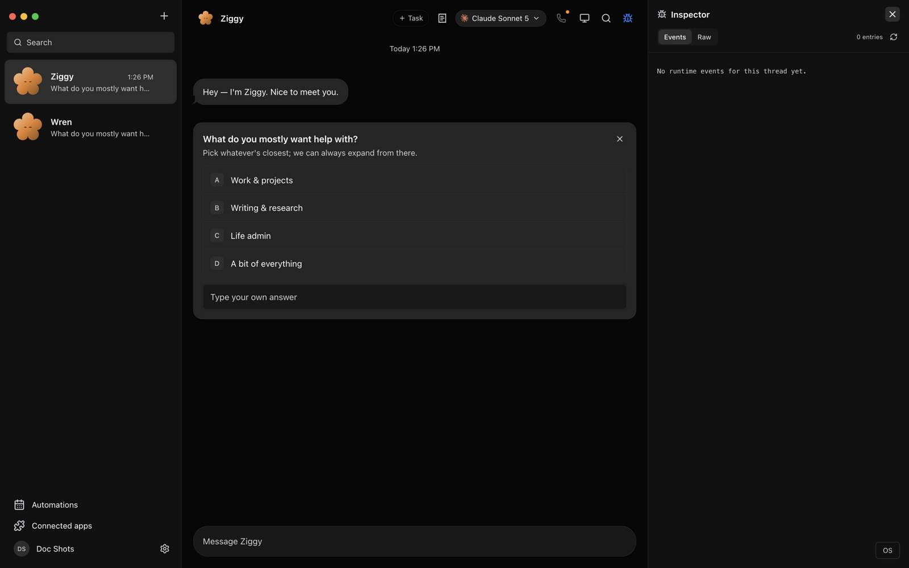
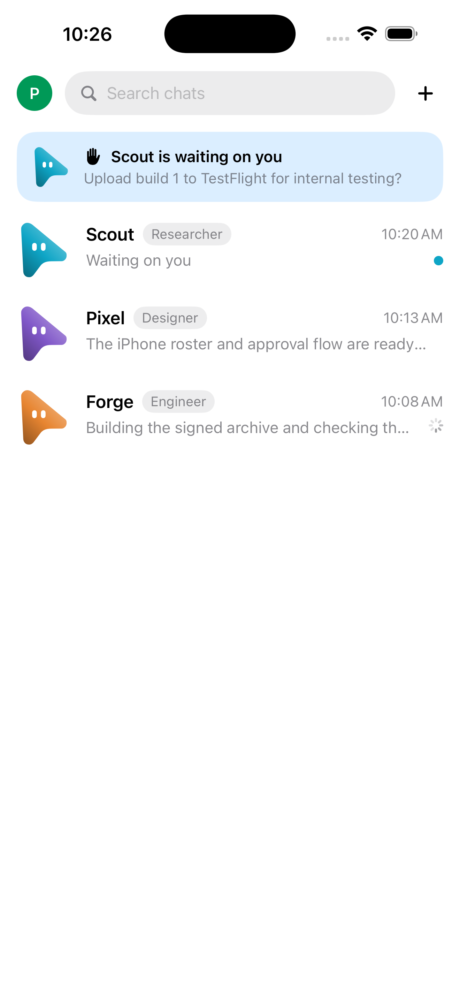

<div align="center">
  

# Muster

**A workspace for your team of AI agents.**

[Open Muster](https://muster.orazen.online/app) · [Desktop downloads](https://muster.orazen.online/download.html) · [Product docs](https://muster.orazen.online/docs)


</div>

Muster brings named AI teammates, conversations, tools and human decisions into one workspace.
Use the desktop or web interface to give work to a bot, follow its progress, and respond when a supported engine requests a decision.

This is Muster's **private product repository**, maintained by Tharun Ramagiri at Orazen.
It contains the desktop application, server, web interface, CLI and companion clients.
Repository access is for authorized development and operation of Muster.

## The product, in screenshots

All images below are real repository-owned captures (`docs/screenshots/`); none are mockups or stock media.

| Muster OS desktop shell | Human approval moment |
|---|---|
|  |  |

| Connected apps | Per-bot model choice | Bot settings | Computer surface | iOS companion |
|---|---|---|---|---|
|  |  |  |  |  |

## Product surfaces

- **Teammates and conversations:** bot profiles, memory, task threads, rooms and streamed replies.
- **Tools and decisions:** engine drivers, connected tools, computer integrations, permission cards and questions. Available controls depend on the engine and configured services.
- **Work over time:** routines, goals, execution journals and task receipts. These provide workflow controls and records, not guarantees of successful autonomous work.
- **Workspace brain:** explicit facts with mandatory provenance, correction chains, withdrawal that preserves history, and keyword retrieval with gap analysis; institutional memory can bias the Chief-of-Staff's team ranking (capped, explainable).
- **Onboarding:** seven stages led by the Flower mascot, account-scoped drafts and explicit first-task recovery. Saved welcome answers have their own durable recording and dispatch contract.
- **Companions:** iOS, Apple Watch and Android clients connect to the desktop companion service for supported conversation and decision actions.

Provider sign-in, connector authorization, computer access and Muster account sign-in are separate setup steps.
External services can have their own charges and data handling. A local desktop interface does not mean every operation stays on the device.

## Current boundaries

| Area | Implemented and checked scope | Separate work or acceptance |
|---|---|---|
| Welcome answers | Recording, status and explicit recovery paths; see [the contract](docs/seed-answers.md). | Engine-specific real task outcomes and release acceptance. |
| Conversation recovery | Required missing ancestors are persisted with a later durable descendant or selected branch. | Already-lost unsaved memory, failed patches to existing durable rows, and complete backup. |
| Native companions | Focused core and owned simulator/emulator scenarios are documented in the native runbooks. | Physical-device coverage, distribution/signing, and the pending Watch composer runtime gate. |
| Workspace backup | Manual, partial and installation-wide export/restore; capability-gated account-Drive connect, push and pull proven over a real booted server (`server/account-drive-roundtrip.test.ts`). | Portable full restore across installs and automatic cross-device sync. |

The current backup excludes conversation history and provider connections. Recovery requires the original installation secret as well as the passphrase; a Google sign-in is not a desktop backup connection.
Read [the backup contract and remaining gates](docs/plans/portable-backup-contract-2026-09-12.md) before changing recovery behavior.

Verification is recorded per source revision and scenario; [the current-state snapshot](docs/plans/current-state.md) is the status of record and [the engineering ledger](docs/plans/ceo-log.md) holds actual counts, retained failures and acceptance limits.
A passing local check is not proof that a new desktop or mobile release has shipped.
The [private-product and bot-network roadmap](docs/plans/private-product-network-direction-2026-09-12.md) describes proposed work separately from implemented capabilities, and [the remaining-work plan](docs/plans/remaining-work-plan-2026-09-16.md) separates verified, acceptance-only, blocked and proposed items.

## Architecture

The server owns the fleet, provider processes, persistence and dispatch. Clients issue authenticated HTTP commands and consume server events; Electron also exposes native capabilities through its bridge.

| Area | Source |
|---|---|
| React web interface and Muster OS | [src/](src/) |
| HTTP/SSE API and wire contracts | [server/index.ts](server/index.ts), [server/contracts.ts](server/contracts.ts) |
| Fleet state, transcripts and engine adapters | [server/store.ts](server/store.ts), [server/message-db.ts](server/message-db.ts), [server/drivers/](server/drivers/) |
| Evaluation: fleet playbooks and per-role benchmarks | [server/fleet-eval.ts](server/fleet-eval.ts), [server/role-eval.ts](server/role-eval.ts) |
| Workspace brain and Chief-of-Staff dispatch | [server/workspace-brain.ts](server/workspace-brain.ts), [server/jev-dispatch.ts](server/jev-dispatch.ts) |
| Electron main process and preload | [electron/](electron/) |
| Companion service and clients | [companion/](companion/), [ios/](ios/), [android-companion/](android-companion/) |
| CLI and product documentation site | [cli/muster.mjs](cli/muster.mjs), [www/](www/) |

## Authorized development

Read [AGENTS.md](AGENTS.md) and the [web app stability contract](docs/guides/web-app-stability.md) first. Keep work on `main`, scope each change, preserve the approved interface and unrelated work, and record actual verification before committing.
Use Node 24 and the pinned pnpm 10.33.0 toolchain for the current development/CI baseline; `package.json` declares a Node 22 minimum.

From an authorized checkout, install with `pnpm install --frozen-lockfile`. Choose
and check an owned backend port and data directory, then set `OMB_PORT` and
`OMB_DATA_DIR` before running `pnpm dev:server`. In another terminal, set the same
`OMB_PORT`, choose an explicit `OMB_UI_PORT`, and run `pnpm dev`. The preview
refuses missing/wrong backend identity and an occupied UI port. Port 8799 may
belong to another installed application.

For Electron development, set `ELECTRON_START_URL` to that exact owned frontend
origin before running `pnpm dev:desktop`. For a review that should stay unchanged
while source edits continue, build once and use `pnpm preview` with the explicit
backend port and a free `--port`; do not rebuild that review snapshot mid-test.

Use isolated data directories and synthetic credentials for tests. Never stop or alter the existing demo service on port 8845.
Keep credentials out of commits and logs; use the supported settings or environment configuration for each integration.
The checked-in CLI is available as `node cli/muster.mjs --help`.

## Checks and release work

```sh
pnpm lint
pnpm typecheck
pnpm test
pnpm build
pnpm check:electron
```

`pnpm test` runs the root Vitest suite, broker tests, updater tests and the standalone packaged-server smoke gate.
For a focused server change, use `pnpm exec vitest run server/<file>.test.ts` before the full gate.
Browser acceptance uses `pnpm test:e2e` with the documented owned fixtures (`e2e/`); rebuild with `pnpm build` first or the browser tests exercise a stale bundle. Native acceptance has separate toolchains and cleanup requirements.
Per-role benchmark grading runs offline via `muster bench capture.json scorecard.json` (see [server/role-eval.ts](server/role-eval.ts)); the capture is evidence from a live or simulated run, grading is pure.

- [Desktop and CLI publication contract](docs/release-mirror.md)
- [Release workflow](.github/workflows/release.yml) and [CI workflow](.github/workflows/ci.yml)
- [Install on your own iPhone and Watch](docs/guides/personal-iphone-watch-install.md) using a Personal Team
- [Verification while GitHub Actions is blocked](docs/guides/verification-without-actions.md)
- [iOS and Watch testing](ios/TESTING.md), [mobile release](docs/mobile-release.md), [Android release](docs/android-release.md)
- [Android companion development](android-companion/README.md)

Packaging commands are `pnpm package:mac`, `pnpm package:win` and `pnpm package:linux`; they build locally without publishing by default.
Platform artifacts still require their own installation, signing and updater checks. A workflow definition or local build does not establish remote CI success.
Version bumps, tags, publication and production deployment are separate authorized release actions; do not use them as verification shortcuts.
Production checks use **GET**, not HEAD. Follow the current release ledger before triggering anything that can deploy.

## License

See [LICENSE](LICENSE) for the Business Source License 1.1 terms, stated exceptions and change terms.
This README does not amend the license or grant additional access or distribution rights.
