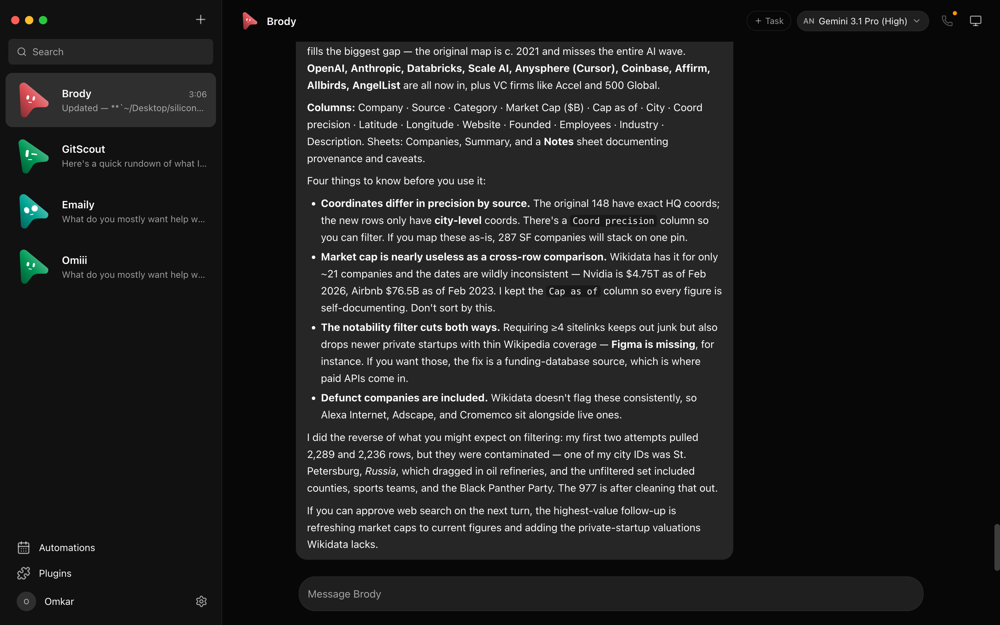
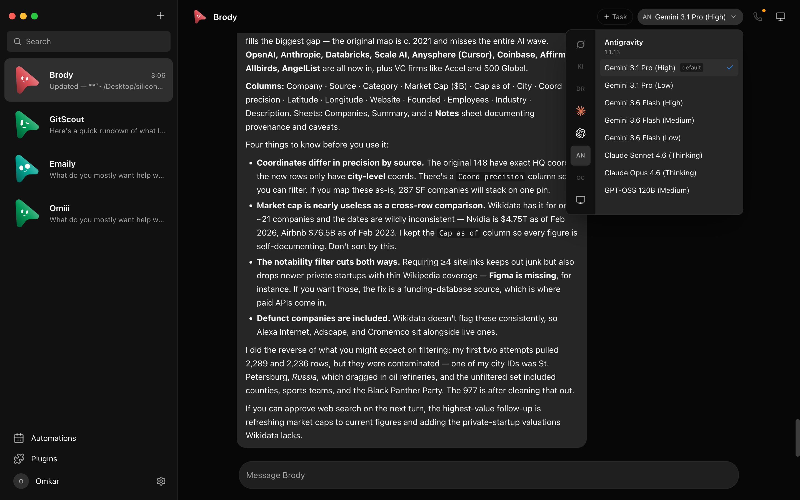
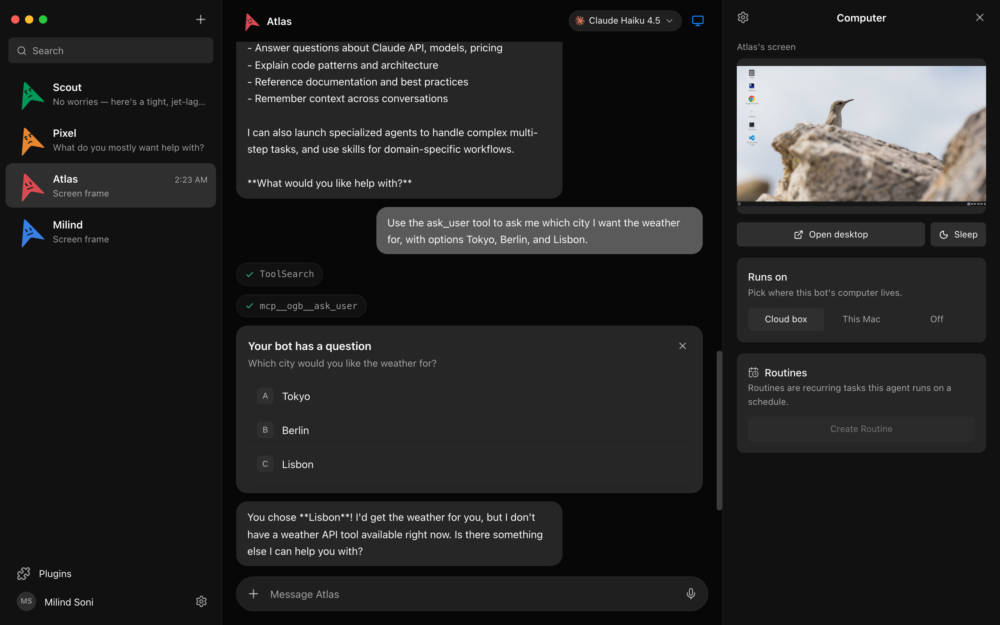
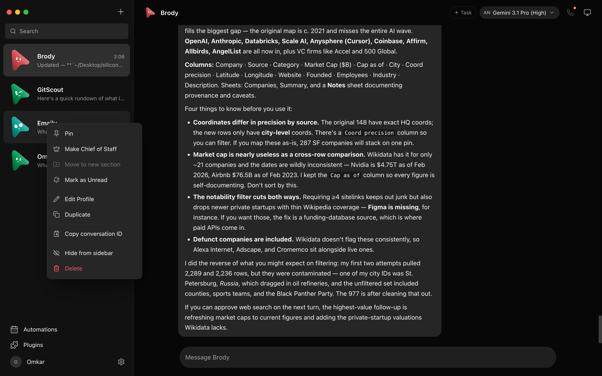
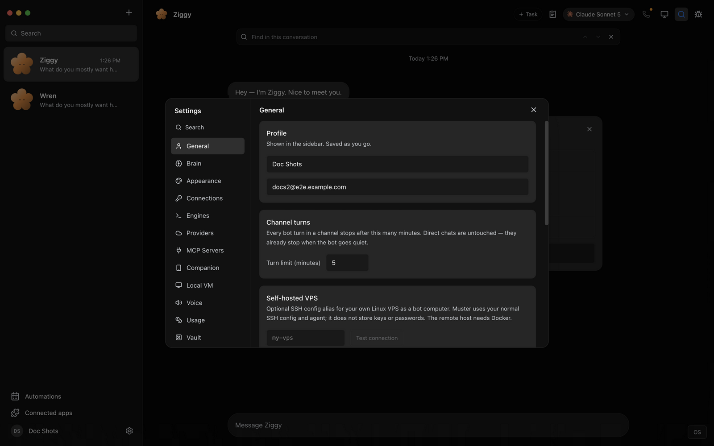
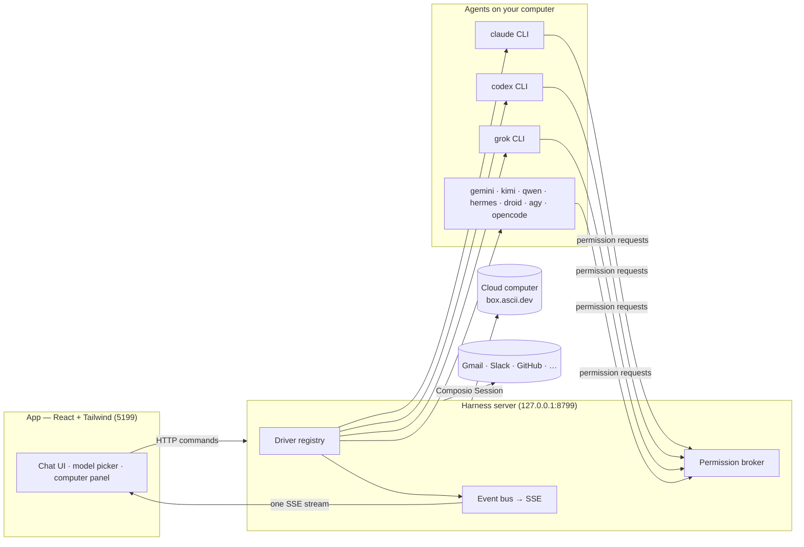

> ⚠️ **No affiliation with any cryptocurrency.** Muster has no token. Any coin using the Muster name is not created, endorsed, or affiliated with this project, Orazen, or its maintainers. We have received no tokens, payment, or allocation from anyone, and we will not be endorsing any token.

<div align="center">

# Muster

**Muster your agents.**

<sub>A local-first roster of AI agents you actually own — bring your own Claude, Codex, Grok, Gemini, Kimi, Qwen, Hermes, Droid, Antigravity, or OpenCode Go CLI, give each one a body, and run your team from a chat app, not a subscription.</sub>

Every bot in the sidebar is a real agent — a model running locally under the hood — with its own
personality, its own model, its own cloud computer, and its own connected apps.
Talk to them like contacts. Watch them work. Approve what matters.

<sub>Built and maintained by [Orazen](https://orazen.online) — AI, Web, Automation & Digital Agency.</sub>


<br>

<a href="https://github.com/Orazen/Muster/releases/latest/download/Muster.dmg">
  
</a>
&nbsp;
<a href="https://github.com/Orazen/Muster/releases/latest/download/Muster-setup.exe">
  
</a>

<sub>macOS: Apple silicon · unsigned build (see note below) &nbsp;·&nbsp; Windows: 64-bit · one-click installer, no admin rights &nbsp;·&nbsp; both always the latest · [all releases](https://github.com/Orazen/Muster/releases)</sub>

<br>
<br>



</div>

---

## Why

One assistant in one box is the wrong shape for agents. Muster treats AI the way a real team works: a
*roster* of agents you chat with like contacts, each with its own personality, memory of its own thread,
model, computer, and connected apps — open, local-first, and running on the agents you already pay for:

- **Bring your own agents.** Bots run on the CLIs installed on your own machine — `claude`, `codex`, `grok`,
  `gemini`, `kimi`, `qwen`, `hermes`, `droid`, `agy` (Antigravity), or `opencode` — your existing logins and
  subscriptions, no new accounts, no proxy in the middle. Point any engine at a custom CLI binary (a
  versioned build or wrapper) in **Settings → Engines**.
- **Local first.** One small harness server on `127.0.0.1` owns every agent process. Transcripts, keys, and
  events live in `~/.muster`, not a cloud.
- **Agents with hands.** Each bot can get a real computer — a cloud Linux desktop it drives while you watch
  live, or your own Mac — plus 500+ connected apps through Composio.

## Features

<table>
<tr>
<td width="50%" valign="top">

### 🧠 Pick a brain per bot

A model picker with a provider rail — engine families side by side, defaults marked, unavailable
providers dimmed with the reason. Switch a bot's model mid-conversation.



</td>
<td width="50%" valign="top">

### 🖥️ Every bot gets a computer

Open the Computer panel and the bot's cloud desktop spins up on its own — live screen preview while it
works, "Open desktop" to take over in your browser, or point the bot at *this Mac* instead.



</td>
</tr>
<tr>
<td width="50%" valign="top">

### 🙋 Bots ask before they act

Shell commands, file edits, and questions surface as inline cards — Allow / Deny / answer in chat. A
permission broker turns every risky action into a decision you make, for cloud and local computers alike.


</td>
<td width="50%" valign="top">

### 🔌 Connected apps

A one-click marketplace over Composio Sessions: Gmail, Slack, GitHub, Notion, Linear and hundreds more.
OAuth once, and every bot can use them as tools.


</td>
</tr>
<tr>
<td width="50%" valign="top">

### 🗂 Manage bots like chats

Right-click any bot: pin, mark unread, edit profile, duplicate, copy conversation ID, hide, delete. It's a
messaging app — your agents behave like contacts.



</td>
<td width="50%" valign="top">

### 🔑 Keys once, everything lights up

Paste credentials in App Settings — they persist locally and the provider fleet hot-reloads instantly.
Secrets are write-only: the UI only ever sees "configured" flags.



</td>
</tr>
</table>

### 🎧 Bots that talk back

Press the speaker on any reply, or switch a bot to read its answers out as they land — so you can listen
to what ran overnight while you make breakfast. Hit **call** and it's a conversation: it hears you, tells
you what it's doing while it works, and asks for approvals out loud.

Bring your own ElevenLabs key — paste it once in App Settings, pick a voice, and every bot can talk.
Give a bot its own voice and a room stops sounding like one person.

**Also in the box:** streaming replies with tool-run activity chips · native macOS dictation from the
composer mic (on-device Apple speech recognition — desktop app) · Muster agent avatars with role-aware
expressions · screenshots of the bot's work folded into the transcript.

### 🤝 Bots that work together

Agents aren't silos. Groups put several bots in one room with multi-agent routing, and a **group call**
arranges a live panel. Bots hand work to peers with **delegation** (`delegate_bot`), and messages sent to a
busy bot queue and drain into one turn instead of bouncing. A **chief-of-staff** composite can front a set
of members, and the **team library** lets you import a whole roster — its own `muster.team` manifest with
members, titles, skills, and required apps — from a catalog or a file, in one click.

### ⏱ Routines, tasks, and webhooks

Schedule a **routine** to run once or on selected weekdays on a bot's model/computer or cloud runner.
Attach a **webhook trigger** to run a queued task when an external service posts to it — the webhook-only
receiver on `127.0.0.1:8800` (or `OMB_WEBHOOK_PORT`) exposes just `/health` and secret `/hooks/...`
endpoints, never the app's broader API. One-time delivery secrets rotate; bearer auth is recommended.

### 🧰 Plugins (MCP) and local computer use

The Plugins panel toggles which MCP servers get injected into each bot's `--mcp-config` — same pattern as
Claude Desktop. Local computer use ships a bundled `cua-driver` (Rust) behind a single named TCC prompt, so
bots can drive *this Mac* with no separate installs.

## Engines

Muster ships drivers for a dozen engines. Any CLI on your PATH that speaks the right protocol can be added
as a custom engine in **Settings → Engines**. Engines split into a subscription rail (first-party catalog
models) and a custom rail (bring a CLI, inject a model).

| Engine | Driver kind | CLI | Notes |
|---|---|---|---|
| Claude | `claudeAgent` | `claude` | Claude Code; stream-JSON, full per-action approvals. |
| Codex | `codex` | `codex` | OpenAI Codex CLI. |
| Grok | `grok` | `grok` | xAI Grok CLI (API and Build over ACP stdio). |
| Gemini | `geminiAgent` | `gemini` | Google Gemini CLI over ACP; **retired from the default fleet** — enable in config. |
| Kimi | `kimiAgent` | `kimi` | Moonshot Kimi over ACP stdio. |
| Qwen | `qwenAgent` | `qwen` | Qwen Code over ACP stdio. |
| Hermes | `hermesAgent` | `hermes` | Nous Research Hermes over ACP stdio. |
| Droid | `droidAgent` | `droid` | Factory Droid over ACP stdio. |
| Antigravity | `antigravityAgent` | `agy` | Google Antigravity (`agy --print`); no per-action broker yet. |
| OpenCode Go | `opencodeGo` | `opencode` | OpenCode CLI over ACP stdio; key injected as `OPENCODE_API_KEY`. |
| Computer | `boxAgent` | cloud | Cloud Linux computer agent — runs the turn on the bot's own Box (box.ascii.dev), no local CLI. |

Unknown drivers degrade to "unavailable" shadows — a config from a newer build round-trips safely and
never crashes the fleet.

## How it works

Two processes. The app holds no transports of its own — it sends typed commands over HTTP and folds one SSE
event stream into state. The harness server owns every agent process and normalizes each provider's native
protocol into one canonical runtime event stream (logged per-thread as NDJSON).



| Layer | Where | What it does |
|---|---|---|
| Drivers | `server/drivers/` | One per provider: Claude, Codex, Grok, Gemini, Kimi, Qwen, Hermes, Droid, Antigravity, OpenCode Go over their local CLIs (stream-JSON / JSON-RPC / ACP stdio), plus a cloud-computer agent. Unknown drivers degrade to "unavailable", never crash the fleet. |
| Harness | `server/harness/` | Registry (configs → live instances) and the fan-in event bus every client folds. |
| API | `server/index.ts` | Bots, turns, approvals, model catalog, computer lifecycle, connectors, routines, webhooks, teams, config — HTTP + SSE. |
| Voice | `server/tts/` | ElevenLabs, bring your own key. Runs on the harness so the key never reaches the UI; markdown is rewritten into something worth hearing before it is spoken. |
| App | `src/` | The chat shell. Server-backed store, one reducer, zero client-side transports. |
| Desktop | `electron/` | macOS, Windows, and Ubuntu shells with an embedded harness and explicit platform capabilities; Apple speech, local screen capture, and the current CUA bridge remain macOS-only. |

## Quick start

**Released builds:** the harness server is embedded, so macOS and Windows need no separate server setup.

| | Download | Install |
|---|---|---|
| **macOS** (Apple silicon) — **recommended: Homebrew** | `brew tap orazen/muster && brew install --cask muster` | Homebrew clears the quarantine flag automatically on install, so it just works — no Gatekeeper "damaged" message. |
| **macOS** (Apple silicon) — direct download | [Muster.dmg](https://github.com/Orazen/Muster/releases/latest/download/Muster.dmg) | Drag it to Applications, open it. **Not yet signed/notarized** — macOS Gatekeeper will say *"Muster is damaged and can't be opened. You should move it to the Bin."* This is not real damage, it's an unsigned-app quarantine flag. Fix: open Terminal and run `xattr -cr /Applications/Muster.app`, then open it again — or just use Homebrew above, which avoids this entirely. (Proper Developer ID signing + notarization is tracked, see below.) |
| **Windows** (x64) | [Muster-setup.exe](https://github.com/Orazen/Muster/releases/latest/download/Muster-setup.exe) | Run it — one-click, per-user, no admin rights. The installer isn't code-signed yet, so SmartScreen shows "unknown publisher": **More info → Run anyway**. |
| **Linux** (x64) | [Muster.deb](https://github.com/Orazen/Muster/releases/latest/download/Muster.deb) · [Muster.AppImage](https://github.com/Orazen/Muster/releases/latest/download/Muster.AppImage) | `.deb`: `sudo dpkg -i Muster.deb` · AppImage: `chmod +x Muster.AppImage && ./Muster.AppImage` |
| **Android** | [Play Store](https://play.google.com/store/apps/details?id=com.muster.companion) (coming soon) | Pair with your computer's companion service |
| **iOS** | [App Store](https://apps.apple.com/app/muster-mobile/id1234567890) (coming soon) | Pair with your computer's companion service |

**Homebrew (macOS):**

```sh
brew tap orazen/muster
brew install --cask muster
```

Requires [Homebrew](https://brew.sh). Auto-updates via `brew upgrade --cask muster`.

**From source:**

```sh
git clone https://github.com/Orazen/Muster && cd Muster
pnpm install

pnpm dev:server    # harness server → 127.0.0.1:8799
pnpm dev           # app → http://127.0.0.1:5199
pnpm dev:desktop   # Electron shell; keep the two commands above running
```

Requirements: **macOS, Windows, or Ubuntu 24.04 x64**, **Node 24+**, **pnpm**, and at least one agent CLI
(e.g. [`claude`](https://claude.com/claude-code), [`codex`](https://github.com/openai/codex), or
[`grok`](https://x.ai/cli)) installed and logged in. They appear in the model picker automatically.

Package the desktop application:

```sh
pnpm package:mac      # macOS: DMG + ZIP; requires Swift/Xcode tools
pnpm package:win      # Windows: installer + ZIP
pnpm package:linux    # Ubuntu x64: .deb + AppImage; no Swift required
```

### Desktop capability status

| Capability | macOS | Ubuntu 24.04 Xorg | Ubuntu 24.04 Wayland |
|---|---|---|---|
| Packaged app, embedded harness, local agent CLIs | Supported | Beta | Beta |
| Composio and Box/cloud computers | Supported | Beta | Beta |
| Local screen preview and computer control | Supported | Planned | Planned after compositor validation |
| Native on-device dictation | Supported | Planned | Planned |

Unavailable native features fail closed on Ubuntu without blocking chat or cloud features. Linux local computer
control, Wayland capture/automation, dictation, and ARM64 are tracked in
[#29](https://github.com/Orazen/Muster/issues/29) and are not claimed by the baseline package.

### Self-host (web)

Muster is local-first, but the same web UI and harness can run as a single-user
web service in any browser via Docker — no Electron, no macOS requirement:

```sh
docker compose up -d --build   # then open http://localhost:8799
```

Bring your own agent CLIs (or engine keys), and reverse-proxy with TLS if you
expose it beyond your machine. There are **no accounts** — see
[docs/self-host.md](docs/self-host.md) for configuration, security, and model
setup.

### Optional credentials

These credentials are optional — local chat works without them. Paste a key once in **App Settings** (gear
in the sidebar footer) when you want to enable its integration:

| Credential | What it enables | Where to get it |
|---|---|---|
| Composio project key (`ak_…`) | Connect Gmail, GitHub, Slack, Notion, and other apps to your bots | [Muster Composio setup](docs/composio.md) |
| Box API key | Give bots an isolated remote Linux computer with a desktop and terminal | [Box API key guide](https://docs.ascii.dev/box/api-keys) |
| ElevenLabs key | Read replies aloud, and call your bots | [ElevenLabs API keys](https://elevenlabs.io/app/settings/api-keys) |
| OpenCode Go key | Run the OpenCode Go engine | [OpenCode Go docs](https://opencode.ai/docs/go/) |

Composio and Box are third-party services with their own accounts and terms. Box is a paid service after
its trial, and using a cloud computer may incur charges.

### Mobile companions

The iOS and Android apps are thin clients that connect to the same companion
service on your computer. They let you:

- Answer approvals and questions on the go
- Follow replies as they stream
- Send messages to bots and rooms
- Search transcripts and share as Markdown/JSON

The phone owns nothing — your computer is the source of truth for all bot
data, credentials, and transcripts. See [`ios/README.md`](ios/README.md) and
[`android-companion/README.md`](android-companion/README.md) for details.

| Platform | Status | Notes |
|---|---|---|
| iOS | Built, ready for App Store submission | Needs Apple Developer account |
| Android | Built (React Native + Expo) | Needs Play Store developer account |

### Development commands

```sh
pnpm typecheck      # app + server
pnpm test           # unit, driver, API, and desktop capability tests
pnpm build          # typecheck + production build
pnpm check:electron # syntax-check Electron main/preload files
pnpm package:win    # Windows installer + zip → release/
pnpm package:linux  # Ubuntu x64 .deb + AppImage → release/
```

### Releasing

```sh
pnpm bump patch          # 0.1.27 → 0.1.28 (also: minor, major, or explicit 0.2.0)
pnpm bump patch --push   # same, but also pushes the tag → triggers release.yml
```

The `release.yml` workflow builds macOS, Windows, and Linux in parallel, then creates a GitHub Release with all artifacts and the auto-update YML files.

## Status

Early but real — the loop works end to end: message → agent → streamed reply → tools → approvals →
computer use. macOS and Windows have released builds; Ubuntu 24.04 x64 packages are in beta with the
capability limits above. Self-hosting is supported via Docker (single-user, see above); a hosted multi-user
service and mobile connectivity are still being built, and webhook triggers currently
use the local receiver rather than an always-on hosted relay.
Voice needs an ElevenLabs key, and calls are macOS-only for now (they ride the same on-device dictation as
the composer mic) — see [`docs/voice-mode.md`](docs/voice-mode.md) for the design and the known gaps.

Contributions welcome — the driver SPI in [`server/contracts.ts`](server/contracts.ts) is deliberately
small; adding a provider is one file in [`server/drivers/`](server/drivers/) plus a one-line registration.

## License

[Business Source License 1.1](LICENSE) © 2026 Ramagiritharun (Tharun Ramagiri) / Orazen and contributors.

Source-available. You may use, modify, and redistribute for personal, internal,
and non-commercial purposes. You may **not** offer Muster (or a substantially
similar product) as a managed service. After 2030-08-19 the license converts
to [Apache 2.0](LICENSE).
