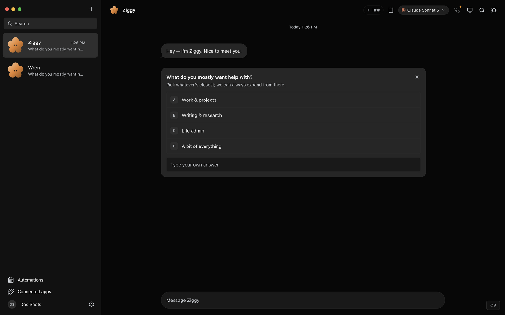
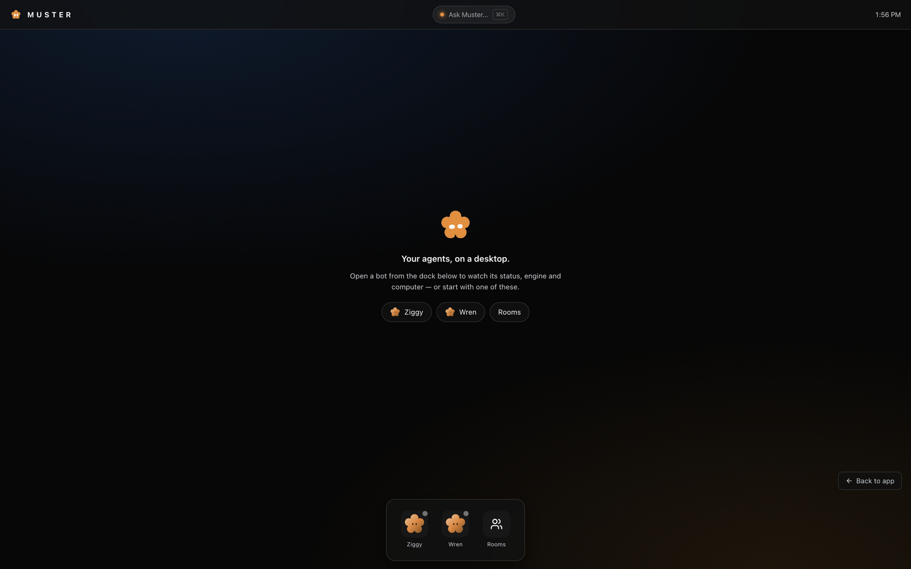
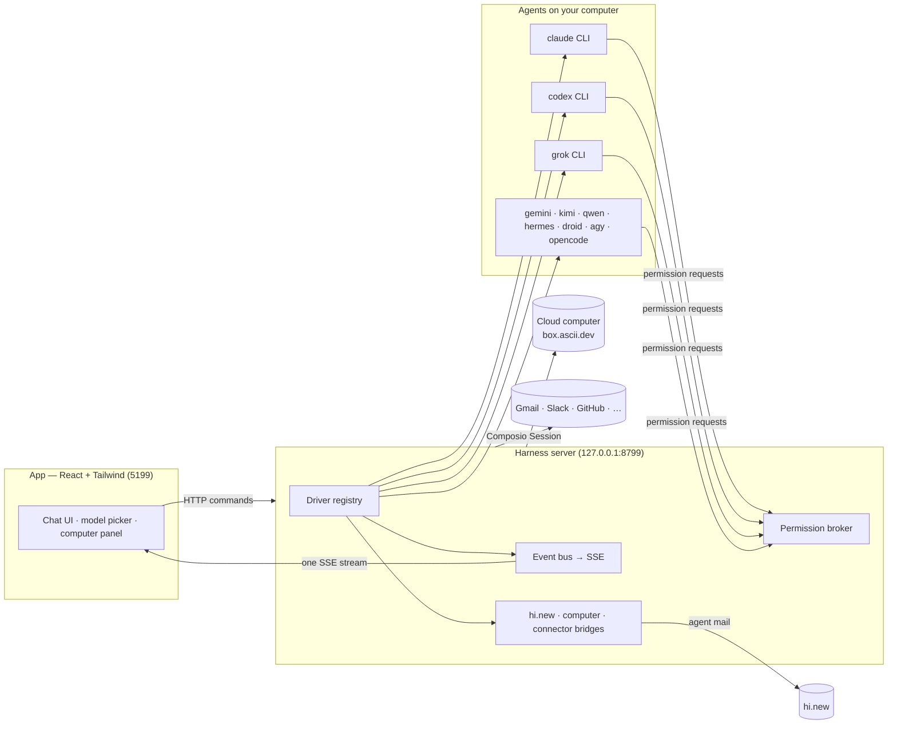

> ⚠️ **No affiliation with any cryptocurrency.** Muster has no token. Any coin using the Muster name is not created, endorsed, or affiliated with this project, Orazen, or its maintainers. We have received no tokens, payment, or allocation from anyone.

<div align="center">

# Muster

**The agent workforce you can actually own.**

<sub>Persistent, governed, verifiable, self-hostable. Bring your own Claude, Codex, Grok, Gemini, Kimi, Qwen, Hermes, Droid, Antigravity, or OpenCode Go CLI — or any of 12 API providers — give each agent a name, memory, guardrails and a real computer, and run your team from a chat app.</sub>

<sub>Muster was built by [Tharun Ramagiri](https://ramagiritharun.in) at [Orazen](https://orazen.online) — an AI, Web, Automation & Digital Agency. · [LinkedIn](https://www.linkedin.com/in/ramagiritharun)</sub>

[](https://github.com/Orazen/Muster)
[](https://github.com/Orazen/Muster)
[](https://github.com/Orazen/Muster)
[](LICENSE)
[](https://github.com/Orazen/Muster/pulls)
[](https://github.com/Orazen/Muster)

<br>

<a href="https://muster.orazen.online/downloads/Muster.dmg">
  
</a>
&nbsp;
<a href="https://muster.orazen.online/downloads/Muster-setup.exe">
  
</a>

<sub>macOS · Windows · Ubuntu · Web · Cloud · Docker self-host · CLI · iOS/Android companions — [all downloads](https://muster.orazen.online/download.html)</sub>

<br>



</div>

---

## Why

One assistant in one box is the wrong shape for agents. Muster treats AI the way a real team works:
a *roster* of agents you chat with like contacts — each with its own personality, memory, model,
guardrails, computer, and connected apps. Local-first: transcripts, keys and events live in `~/.muster`
on your machine, not in a cloud. Three results nobody else ships together:

- **Persistent** — agents keep their persona, memory and thread across tasks. They're coworkers, not chats.
- **Governed** — shell commands and file edits surface as approval cards you Allow or Deny; per-agent
  token budgets and daily USD caps; a Privacy Shield that masks emails/phones/secrets before a cloud
  model sees them.
- **Verifiable** — every settled task ends in a job receipt (bot, duration, tokens, cost, final word),
  and shared receipts carry a detached HMAC signature anyone can verify. Proof-of-work you can paste
  anywhere.

Recent research puts numbers on why this layer matters: the same frontier model scored ~43% on ARC-AGI-3
inside a generic coding harness vs ~99% inside a purpose-built process harness
([Schema harness, 2026](https://schema-harness.github.io/)) — **the harness, not the model, is the product.**
Muster is that harness for work, not puzzles.

## The product in screenshots

| | |
|---|---|
|  |  |
| **Muster OS** — the roster as a desktop: dock, presence bar (who's waiting on you), ⌘K "Ask Muster" console. | **Settings** — engines, providers, keys, MCP servers, integrations in one panel. |

More screens: [model picker](docs/screenshots/model-picker.png) ·
[approval card](docs/screenshots/approval-card.png) ·
[computer panel](docs/screenshots/computer-panel.png) ·
[connected apps](docs/screenshots/marketplace.png)

## What's new

- **Muster OS** — a web-based operating system for your agent workforce: the dock is the roster, the
  shell is a chat, and ⌘K ("Ask Muster…") dispatches real work from anywhere. Bots appear as windows
  with live status, engine and computer.
- **Agent mail (hi.new)** — give your bots mailboxes on [hi.new](https://hi.new), the store-and-forward
  mail network for agents. Bots read, send, invite and redeem peer connections through their `hi_new`
  tools; grants come only from invite links you approve, and inbound mail is treated as untrusted data
  by design. *(Settings → Connections → hi.new agent mail.)*
- **Agent setup docs** — [muster.orazen.online/skill.md](https://muster.orazen.online/skill.md): a
  machine-readable onboarding any agent can follow to pair with an install and operate the roster.
- **Open sign-ups on Muster Cloud** — create an account in seconds; per-workspace isolation is enforced
  at the data layer (ownerId on every record, per-user event streams, operator-gated infrastructure).
- **Interactive mascot** — the musterbot bloom tracks your pointer, reacts to fleet state, and pops
  when clicked.
- Earlier: **sentries** (notify-only-on-change watchers), **signed proof-of-work receipts**,
  **WhatsApp Business channel**, **provider health dashboard**, **referrals**.

## Features

### 🧠 Pick a brain per bot

Every bot runs on the AI CLIs already installed and logged in on your machine — or any of 12 API
providers, or your own OpenAI/Anthropic-compatible endpoint (Ollama and LM Studio on `127.0.0.1` work
out of the box). Swap a bot's model mid-conversation: the cheap one triages, the smart one writes.


**10+ engines over their CLIs:** Claude · Codex · Grok · Gemini · Kimi · Qwen · Hermes · Droid ·
Antigravity · OpenCode Go. Custom binary per engine in **Settings → Engines**.

**12 API providers, no CLI required:**

| Provider | Driver | Env var | Notes |
|---|---|---|---|
| OpenAI | `openai` | `OPENAI_API_KEY` | GPT-4o, GPT-4.1, o3, and family. |
| Anthropic | `anthropic` | `ANTHROPIC_API_KEY` | Claude Opus/Sonnet/Haiku via the Messages API. |
| Google | `google` | `GOOGLE_API_KEY` | Gemini 2.5 Pro/Flash via `generateContent`. |
| xAI (Grok) | `grok` | `XAI_API_KEY` | Same driver as the Grok engine above, API-key mode. |
| DeepSeek | `deepseek` | `DEEPSEEK_API_KEY` | DeepSeek V3/R1, OpenAI-compatible API. |
| Mistral | `mistral` | `MISTRAL_API_KEY` | Mistral Large/Medium/Codestral. |
| Cohere | `cohere` | `COHERE_API_KEY` | Command R/R+ via the v2 Chat API. |
| Groq | `groq` | `GROQ_API_KEY` | Llama/Mixtral/Gemma at high inference speed. |
| Together AI | `together` | `TOGETHER_API_KEY` | Open-source models via Together's API. |
| Fireworks AI | `fireworks` | `FIREWORKS_API_KEY` | Fast inference for open-source models. |
| OpenRouter | `openrouter` | `OPENROUTER_API_KEY` | 200+ models through one key. |
| OpenCode Zen | `opencodeZen` | `OPENCODE_API_KEY` | Free and paid models via OpenCode's hosted gateway. |

All twelve share one architecture — streaming SSE, transcript replay, token-level events — so a bot
can't tell the difference between a CLI and an API provider. **Free to start:** Google AI Studio,
Groq, OpenRouter `:free` models, and OpenCode Zen all have free tiers; paste a browser-obtained key
into **Settings → Providers** and your first bot costs nothing.

**Custom providers (BYO endpoint):** **Settings → Providers → Add model provider** registers *any*
OpenAI- or Anthropic-compatible endpoint as a first-class engine — name, base URL, optional key,
wire format, model list. Self-hosted multi-tenant deployments block loopback/private provider URLs
(SSRF guard); desktop installs allow them, so local Ollama just works.

### 🖥️ Every bot gets a computer

A cloud Linux desktop it drives while you watch live (Box, or self-hosted OpenSandbox), your own Mac,
a per-bot local VM, or a BYO VPS over SSH. Real files, real shell, real browser.


### 🙋 Bots ask before they act

Shell commands and file edits surface as inline cards — Allow, Deny, or answer in the thread. Optional
auto-mode per bot when you trust the loop. Plus per-agent **token budgets**, per-agent **daily USD
caps**, and the on-device **Privacy Shield** (deterministic masking with counts-only receipts).


### 🔌 Connected apps + agent mail

500+ apps (Gmail, Slack, GitHub, Notion, Linear…) through Composio OAuth — and now **agent-to-agent
mail through [hi.new](https://hi.new)**: store-and-forward mail between agents, with grants that come
only from invite links you approve. See
[docs/plans/muster-hi-new-agent-mail.md](docs/plans/muster-hi-new-agent-mail.md) for the design.


### 🤝 Bots that work together

Rooms (multi-bot group threads with @mention routing), delegation, a Chief of Staff that routes work,
group calls, and the team library — installable packs, published to a public directory at
[/bots](https://muster.orazen.online/bots).

### ⏱ Routines, sentries, webhooks

Schedule work, trigger on webhooks, or run **sentries** — watchers that re-check on a cadence and only
notify when the watched state actually changes. Overnight chains run up to 12 iterations through a
shared notes file. Every run keeps a why-journal: intent + key decisions.
See [docs/why-journal.md](docs/why-journal.md).

### 🎧 Voice

Spoken replies and bot calls (bring your own ElevenLabs key), on-device dictation. macOS-first today —
see [docs/voice-mode.md](docs/voice-mode.md).

## For agents (and their humans)

Muster is agent-operable end to end:

- **[skill.md](https://muster.orazen.online/skill.md)** — the onboarding an agent follows to pair with
  an install and operate the roster (pairing, roster, tasks, receipts, memory, untrusted-input rules).
- **CLI** — `muster pair | bots | send <bot> <text> | approve [allow|deny] | status | receipts`, with
  machine-readable `--json` on `bots`/`status`/`receipts`.
- **HTTP + SSE** — the whole product under `/api/*` (same auth as the app).
- **llm.txt** — [muster.orazen.online/llm.txt](https://muster.orazen.online/llm.txt), the platform map.

## How it works

Two processes. The app holds no transports of its own — it sends typed commands over HTTP and folds one
SSE event stream into state. The harness server owns every agent process and normalizes each provider's
native protocol into one canonical runtime event stream (logged per-thread as NDJSON).



| Layer | Where | What it does |
|---|---|---|
| Drivers | `server/drivers/` | One per provider: CLIs (stream-JSON / JSON-RPC / ACP stdio) + cloud-computer agent. Unknown drivers degrade to "unavailable", never crash the fleet. |
| Harness | `server/harness/` | Registry (configs → live instances) and the fan-in event bus every client folds. |
| API | `server/index.ts` | Bots, turns, approvals, model catalog, computer lifecycle, connectors, routines, webhooks, teams, config — HTTP + SSE. |
| Bridges | `server/*-proxy.ts` | Harness-owned stdio MCP servers: hi.new agent mail, computer proxy, permission broker, connectors, Local VM bridge. |
| Voice | `server/tts/` | ElevenLabs, bring your own key; runs on the harness so the key never reaches the UI. |
| App | `src/` | The chat shell + Muster OS. Server-backed store, one reducer, zero client-side transports. |
| Desktop | `electron/` | macOS, Windows, Ubuntu shells with an embedded harness; Apple speech and screen capture are macOS-only today. |

## Quick start

**Released builds:** the harness server is embedded — no separate server setup on macOS/Windows.

| Platform | Download | Install |
|---|---|---|
| **macOS** (Apple silicon) — **recommended: Homebrew** | `brew tap orazen/muster && brew install --cask muster` | Homebrew clears the quarantine flag automatically — no Gatekeeper "damaged" message. |
| **macOS** (Apple silicon) — direct | [Muster.dmg](https://muster.orazen.online/downloads/Muster.dmg) | Drag to Applications. Unsigned build: if Gatekeeper says *"damaged"*, run `xattr -cr /Applications/Muster.app` then open. (Proper signing + notarization tracked.) |
| **macOS** (Intel) | [Muster-intel.dmg](https://muster.orazen.online/downloads/Muster-intel.dmg) | Same as above. |
| **Windows** (x64) | [Muster-setup.exe](https://muster.orazen.online/downloads/Muster-setup.exe) | One-click, per-user, no admin. SmartScreen: **More info → Run anyway** (installer not code-signed yet). |
| **Linux** (x64) | [Muster.deb](https://muster.orazen.online/downloads/Muster.deb) · [AppImage](https://muster.orazen.online/downloads/Muster.AppImage) | `sudo dpkg -i Muster.deb` · `chmod +x Muster.AppImage && ./Muster.AppImage` |
| **Web / Cloud** | [muster.orazen.online/app](https://muster.orazen.online/app) | Nothing to install. Free account; computers from $20/mo. |
| **Self-host** | Docker | `docker compose up -d --build` → http://localhost:8799 — see [docs/self-host.md](docs/self-host.md). |
| **Self-host, one command** | Node 22+ | `node cli/muster.mjs up` (add `-d` to keep it running after the terminal closes) — boot on your machine, scan the QR with your phone, done (below). |
| **iOS / Android** | Built — store listings pending developer accounts | Pair with your computer's companion service. |

### `muster up` — your bots, your machine, your phone

From a Muster checkout (the CLI ships with the repo; an `npx` package may
follow):

```sh
node cli/muster.mjs up        # foreground: Ctrl-C stops Muster
node cli/muster.mjs up -d     # background: close the terminal, Muster keeps running
```

That's the whole install. Muster boots on your computer, generates its own
secret, and prints a QR code in the terminal:

```
  Muster is up. Scan to open the console on your phone:

  http://192.168.x.x:8799/claim#SEH5ZP3S
  ▙▗▄▗▖▚▜▛▚…
```

Scan it with your phone's camera and you land straight in the console —
signed in as the owner, no account creation, no password to invent. The
claim code is single-use and expires in 10 minutes; the pairing itself
never leaves your network.

With `-d` the server detaches from the terminal — shut the terminal
window, end the SSH session, log out; Muster keeps running on the machine
and you check in from your phone: send tasks, answer approvals. (The
machine itself still needs to stay awake — a suspended laptop stops
everything.)

Need a fresh phone later (or a second one)? Run `muster up` again — it
detects the running server and just re-prints a fresh QR against it (no
second server). Re-running while detached works the same way. The claim
code can also be minted directly: `curl -s -X POST
http://127.0.0.1:8799/api/pair/claim/create`.

Managing a detached server:

```sh
node cli/muster.mjs stop      # end it (SIGTERM, then SIGKILL after 10s)
node cli/muster.mjs logs      # tail its output (logs 100 for more)
node cli/muster.mjs logs 200
```

Flags: `--port 8799` (pick another port), `--data-dir <dir>` (move the
database), `--public-host <host>` (you're fronting it with a reverse
proxy). State lives in `~/.muster/` — the auth secret, the database, and
(`up.json` + `up.log` under `run/`) the detached server's record and log.

**Requirements (desktop):** macOS / Windows / Ubuntu 24.04 x64, Node 24+, pnpm, and at least one agent
CLI (e.g. [`claude`](https://claude.com/claude-code), [`codex`](https://github.com/openai/codex),
[`grok`](https://x.ai/cli)) installed and logged in — engines appear in the picker automatically.
No CLI? Paste a free API provider key instead (above).

**From source:**

```sh
git clone https://github.com/Orazen/Muster && cd Muster
pnpm install
pnpm dev:server    # harness server → 127.0.0.1:8799
pnpm dev           # app → http://127.0.0.1:5199
pnpm dev:desktop   # Electron shell (keep the two commands above running)
```

### Optional credentials

All optional — local chat works without them. Paste once in **App Settings**:

| Credential | What it enables | Where |
|---|---|---|
| Composio project key (`ak_…`) | Gmail, GitHub, Slack, Notion + 500 more apps | [docs/composio.md](docs/composio.md) |
| Box API key | Isolated remote Linux computer per bot | [Box API keys](https://docs.ascii.dev/box/api-keys) |
| hi.new token (`hn_…`) | Agent mail: your bots get a mailbox on hi.new | [hi.new](https://hi.new) |
| ElevenLabs key | Spoken replies + bot calls | [ElevenLabs keys](https://elevenlabs.io/app/settings/api-keys) |
| OpenCode Go key | OpenCode Go engine | [OpenCode Go](https://opencode.ai/docs/go/) |
| WhatsApp Business creds | Customers chat with a bot over WhatsApp | [Meta Cloud API](https://developers.facebook.com/docs/whatsapp/cloud-api) |

Composio and Box are third-party services with their own terms; Box is paid after its trial.

### Mobile companions

Thin clients for approvals, streaming replies, messages and transcript search — the phone owns
nothing; your computer stays the source of truth. [iOS](ios/README.md) and
[Android](android-companion/README.md) are built; store listings await developer accounts.

## Documentation

| Doc | What's in it |
|---|---|
| [docs/self-host.md](docs/self-host.md) | Docker self-host: configuration, security, models |
| [docs/composio.md](docs/composio.md) | Connected apps setup |
| [docs/voice-mode.md](docs/voice-mode.md) | Voice design and known gaps |
| [docs/why-journal.md](docs/why-journal.md) | Run intent + decision journals |
| [docs/computer-use-integration.md](docs/computer-use-integration.md) | Computer control architecture |
| [docs/plans/](docs/plans/) | Strategy + design docs (platform, multi-tenancy, agent mail, [win plan](docs/plans/muster-win-plan.md)) |
| [www/llm.txt](www/llm.txt) | Agent-readable platform map |
| [www/skill.md](www/skill.md) | Agent onboarding (served live at /skill.md) |

## Development

```sh
pnpm typecheck      # app + server
pnpm test           # unit, driver, API, and desktop capability tests (1,592 tests)
pnpm build          # typecheck + production build
pnpm lint           # oxlint
pnpm package:mac    # macOS DMG + ZIP
pnpm package:win    # Windows installer + ZIP
pnpm package:linux  # Ubuntu x64 .deb + AppImage
```

Releasing: `pnpm bump patch|minor|major|x.y.z [--push]` — the tag triggers the release workflow
(4 platform builds → gates → GitHub release → download-mirror deploy, unattended).

Contributions welcome — the driver SPI in [`server/contracts.ts`](server/contracts.ts) is deliberately
small; adding a provider is one file in [`server/drivers/`](server/drivers/) plus a one-line registration.

## Status

Early but real — the loop works end to end: message → agent → streamed reply → tools → approvals →
computer use → receipts → shares → referrals. macOS and Windows have released builds; Ubuntu 24.04 x64
is beta with the capability limits below. Voice needs an ElevenLabs key; calls are macOS-only today.

| Capability | macOS | Ubuntu 24.04 Xorg | Ubuntu 24.04 Wayland |
|---|---|---|---|
| Packaged app, embedded harness, local agent CLIs | Supported | Beta | Beta |
| Composio and Box/cloud computers | Supported | Beta | Beta |
| Local screen preview and computer control | Supported | Planned | Planned after compositor validation |
| Native on-device dictation | Supported | Planned | Planned |

Unavailable native features fail closed on Ubuntu without blocking chat or cloud features. Linux local
computer control, Wayland capture, dictation and ARM64 are tracked in
[#29](https://github.com/Orazen/Muster/issues/29).

## License

[Business Source License 1.1](LICENSE) © 2026 Tharun Ramagiri / Orazen and contributors.

Source-available: use, modify, and redistribute for personal, internal, and non-commercial purposes.
You may **not** offer Muster (or a substantially similar product) as a managed service. Converts to
[Apache 2.0](LICENSE) after 2030-08-19. Self-hosting is free forever.
